# Project 12 — Agentic Autonomous Resilience Platform

A local, evidence-driven AIOps lab that detects service degradation, reasons across telemetry and historical incidents, applies safety gates, performs allowlisted remediation, verifies recovery, and learns from every investigated incident.

The project is designed to demonstrate a complete resilience loop rather than a collection of disconnected agents:

**Observe → Diagnose → Reason → Recall → Decide → Remediate → Verify → Learn**

## What this project demonstrates

- Multi-agent incident investigation over live application and JVM telemetry
- Deterministic root-cause reasoning backed by Prometheus evidence
- Historical incident retrieval across the full retained incident corpus
- Top-k memory retrieval for bounded reasoning context
- Temporal/causal analysis before remediation
- Explicit safety gating before autonomous actions
- Post-action recovery verification
- Persistent incident memory, including safely blocked incidents
- Separate learning of remediation outcomes from incident retention
- Optional local-LLM investigation for explanation and supporting analysis
- Reproducible benchmark outputs generated by code rather than hard-coded claims

## Architecture

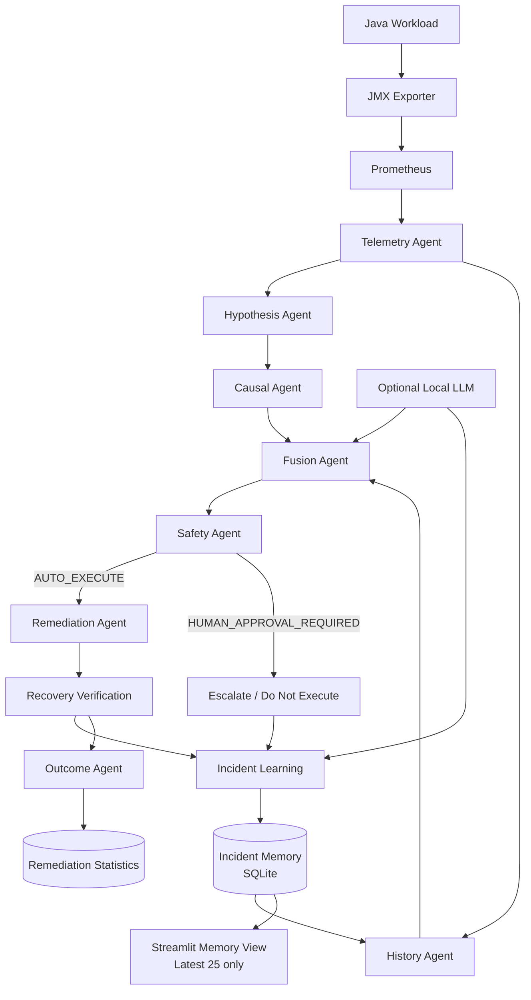

### Memory model

The UI and the learning system intentionally have different limits.

| Component | Behavior |
|---|---|
| Incident database | Retains every investigated incident |
| Streamlit Memory tab | Shows only the newest 25 incidents |
| History Agent corpus | Scores the entire incident database |
| Historical context returned | Top 5 most similar incidents |
| Remediation statistics | Updated only when remediation actually executes |
| Safety-blocked incidents | Stored in incident memory, but not counted as failed remediation attempts |

This separation prevents the UI presentation limit from becoming an artificial learning-retention limit.

## Agents

| Agent | Responsibility |
|---|---|
| `telemetry_agent.py` | Builds an incident-scoped telemetry window from Prometheus |
| `hypothesis_agent.py` | Generates and ranks candidate root causes |
| `causal_agent.py` | Evaluates temporal and causal relationships |
| `history_agent.py` | Scores all historical incidents and returns the most relevant matches |
| `fusion_agent.py` | Combines live evidence, causal reasoning, and historical priors |
| `safety_agent.py` | Determines whether remediation may run autonomously |
| `remediation_agent.py` | Executes allowlisted remediation and verifies recovery |
| `memory_agent.py` | Persists the completed incident into long-term memory |
| `outcome_agent.py` | Learns success/failure statistics for executed remediation actions |
| `llm_investigator.py` | Optional local-LLM investigation and explanation layer |

The LLM is not the sole decision-maker. Deterministic telemetry, causal reasoning, historical evidence, safety policy, and recovery verification remain explicit parts of the control loop.

## Supported fault scenarios

The benchmark currently exercises seven failure modes:

| Scenario | Expected diagnosis |
|---|---|
| `tls_failure` | `tls_failure` |
| `auth_failure` | `authentication_failure` |
| `db_latency` | `database_latency` |
| `retry_storm` | `retry_storm` |
| `consumer_lag` | `consumer_slowdown` |
| `gc_storm` | `gc_storm` |
| `memory_pressure` | `jvm_memory_pressure` |

Scenario definitions live in `scenarios/scenarios.yaml`.

## Validated benchmark evidence

The latest retained validation run completed all seven scenarios successfully:

| Scenario | Detected root cause | Confidence | Safety | Recovery | Result |
|---|---|---:|---|---|---|
| `tls_failure` | `tls_failure` | 0.9588 | AUTO_EXECUTE | True | PASS |
| `auth_failure` | `authentication_failure` | 1.0000 | AUTO_EXECUTE | True | PASS |
| `db_latency` | `database_latency` | 0.9033 | AUTO_EXECUTE | True | PASS |
| `retry_storm` | `retry_storm` | 1.0000 | AUTO_EXECUTE | True | PASS |
| `consumer_lag` | `consumer_slowdown` | 0.9450 | AUTO_EXECUTE | True | PASS |
| `gc_storm` | `gc_storm` | 0.8867 | AUTO_EXECUTE | True | PASS |
| `memory_pressure` | `jvm_memory_pressure` | 0.9121 | AUTO_EXECUTE | True | PASS |

Validated summary:

- **7/7** correct root-cause diagnoses
- **7/7** verified recoveries
- **7/7** end-to-end passes
- Median injection-to-verified-recovery time: **25.978 seconds**

The benchmark artifacts are generated by `scripts/benchmark_resilience.py`. A retained validation snapshot is available under `docs/evidence/`.

### Memory-retention validation

A separate retention test established:

- **31** incidents retained in SQLite
- Streamlit displayed only the newest **25**
- `history_agent.py` searched all **31**
- Historical reasoning returned the top **5** matches
- `HISTORY_AGENT=PASS`

This proves that the UI display limit does not truncate the learning corpus.

### Safety-guardrail validation

A prior `gc_storm` run was diagnosed correctly at confidence `0.6167`, but the safety agent returned `HUMAN_APPROVAL_REQUIRED`.

The system correctly:

- did not execute autonomous remediation,
- stored the incident with `recovery_status=blocked_by_safety`,
- retained it for future historical reasoning,
- left `remediation_success` unset because no remediation was attempted,
- did not create a false failed-remediation statistic.

That behavior is intentional: safety policy can override autonomous execution without discarding the incident from long-term learning.


## Platform Screenshots

### Observability — Grafana

Live workload, JVM, queue, latency, error, and failure telemetry provide the evidence layer used by the investigation agents.

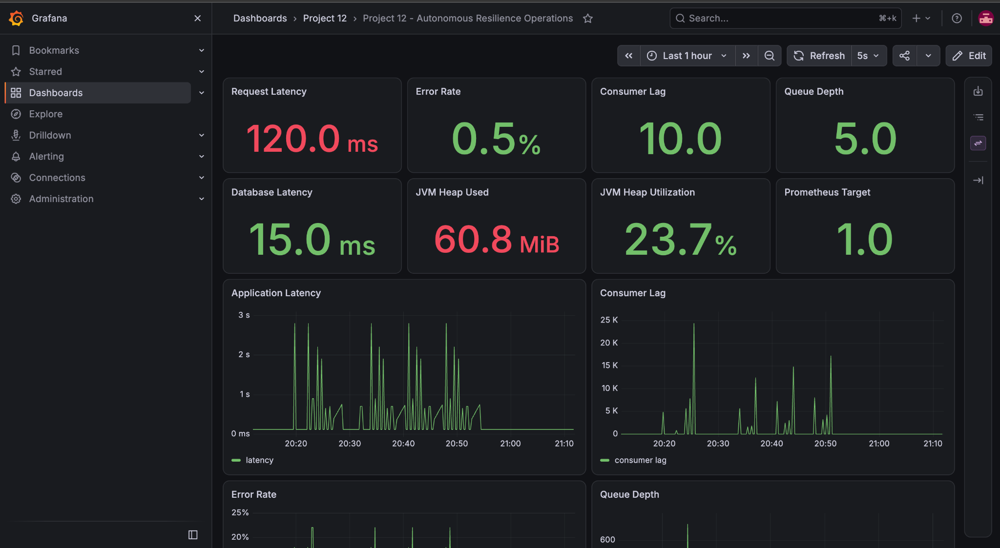

Additional failure-specific telemetry:

<p align="center">
  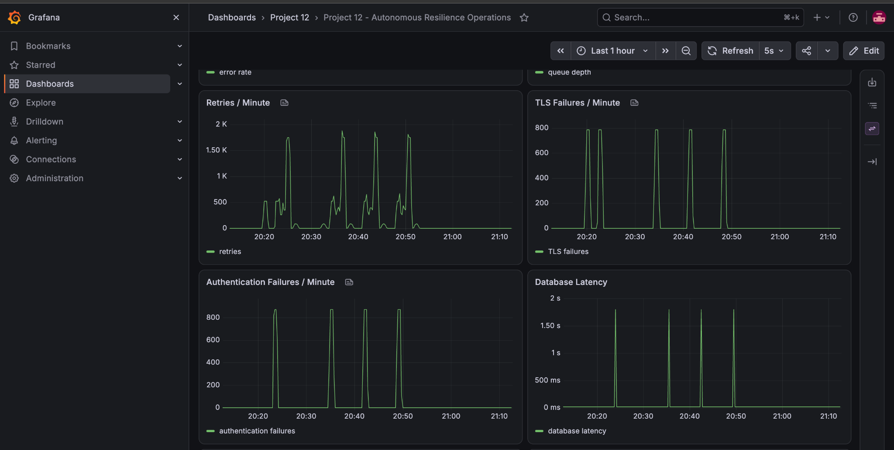
  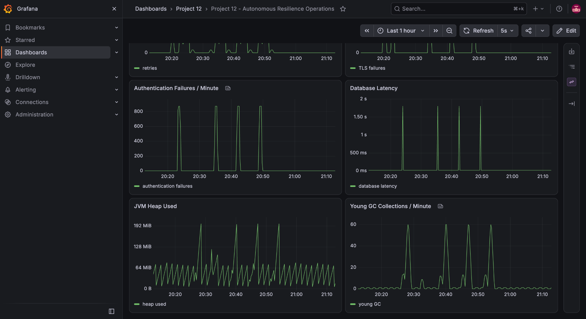
</p>

### Multi-Agent Investigation

The investigation view combines live hypotheses, causal evidence, historical priors, fused confidence, and the resulting safety decision.

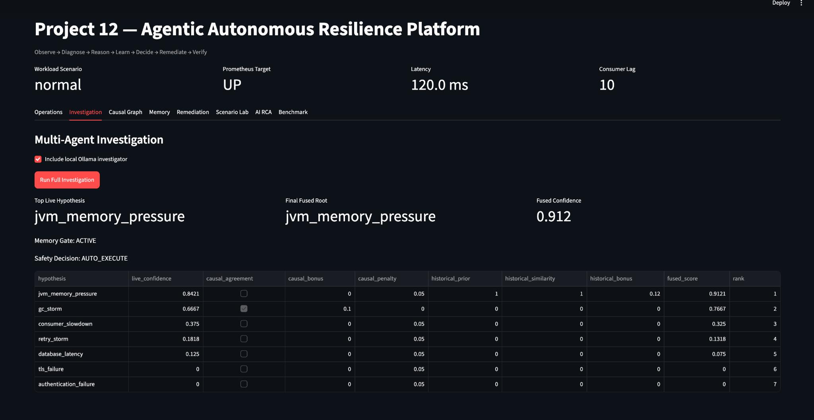

### Temporal and Causal Reasoning

The causal layer reasons about signal ordering and relationships rather than relying only on threshold correlation.

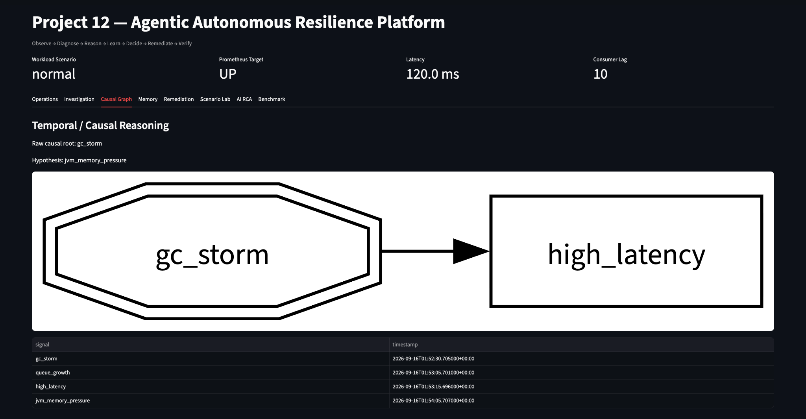

### Persistent Incident Memory

Incident history is retained independently from the UI presentation limit. In this validated run, **31 incidents** were retained while the UI displayed the newest **25**.

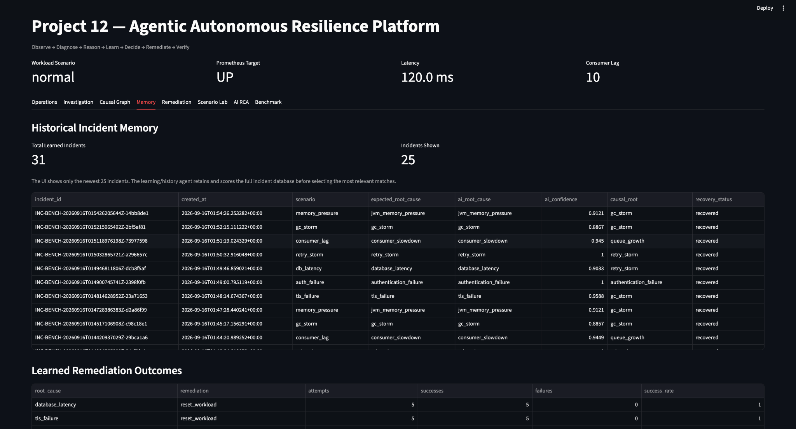

### Risk-Aware Autonomous Remediation

Only allowlisted, low-risk actions can execute automatically after the safety gate approves them.

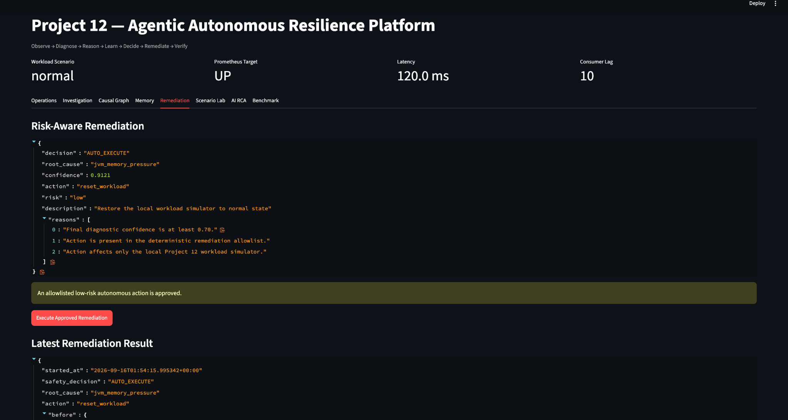

### Autonomous Resilience Benchmark

The benchmark exercises all seven supported fault scenarios and records diagnosis, safety, remediation, and recovery evidence.

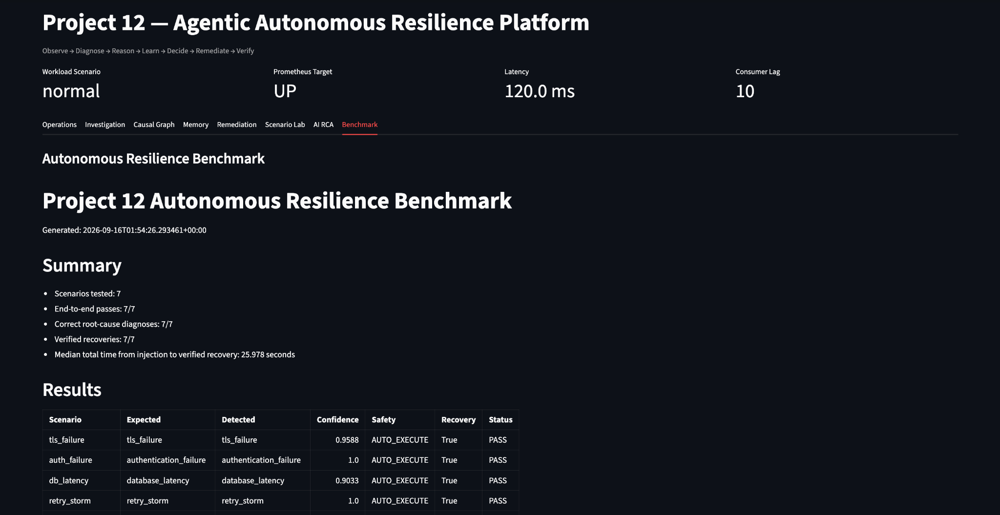

<details>
<summary>Additional UI views</summary>

#### Operations

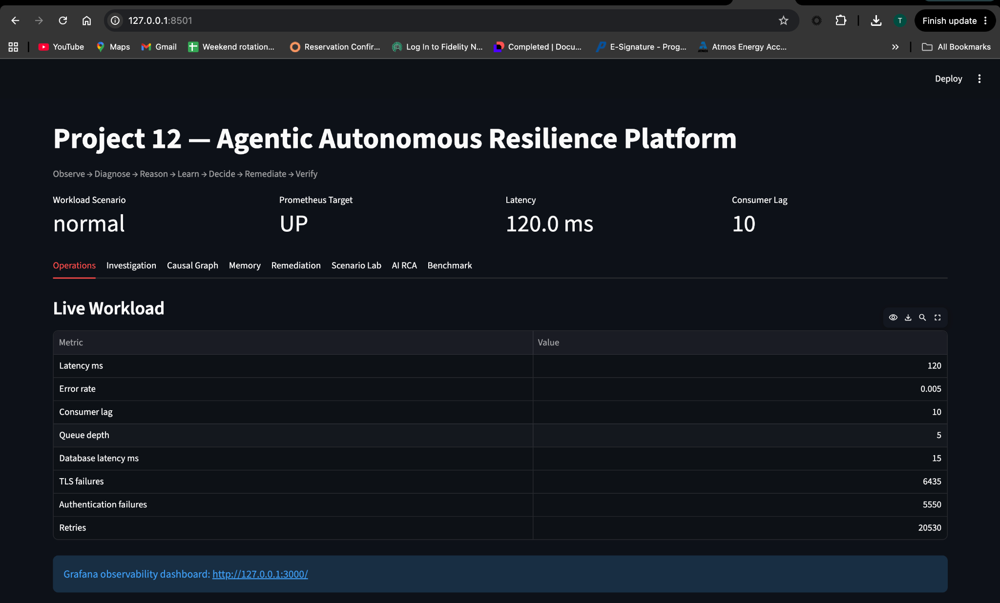

#### Scenario Lab

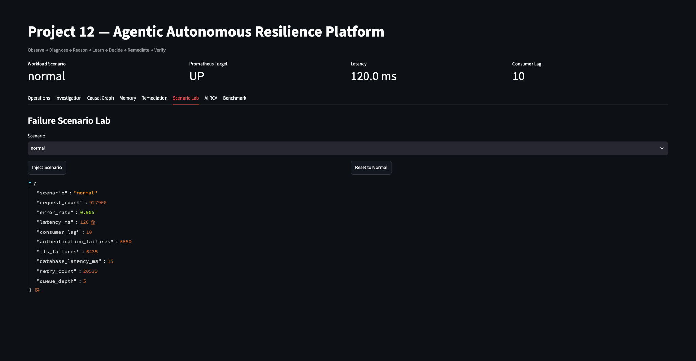

#### Grounded Local LLM RCA

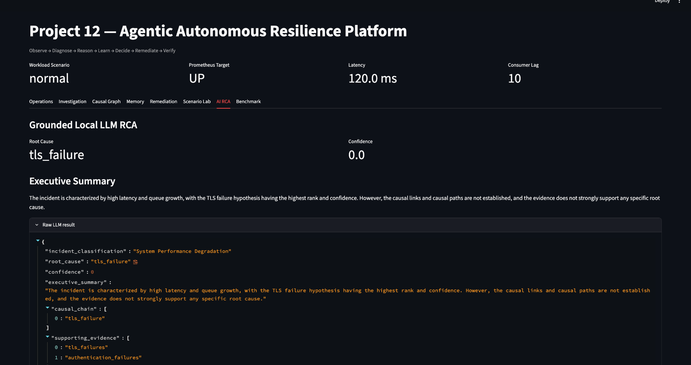

</details>

## Run the benchmark

With the local workload and monitoring stack already running:

```bash
cd 12-agentic-autonomous-resilience-platform

.venv/bin/python scripts/benchmark_resilience.py
```

Run one scenario:

```bash
.venv/bin/python scripts/benchmark_resilience.py --scenario tls_failure
```

Run with the optional local LLM investigator:

```bash
.venv/bin/python scripts/benchmark_resilience.py --scenario tls_failure --with-llm
```

Generated benchmark artifacts are written under:

```text
results/benchmarks/
├── autonomous_resilience_benchmark.csv
├── autonomous_resilience_benchmark.json
└── benchmark_summary.md
```

These runtime outputs are intentionally ignored by Git. The repository keeps explicit validation snapshots under `docs/evidence/` instead.

## Run the Streamlit control plane

```bash
.venv/bin/python -m streamlit run app/streamlit_app.py \
  --server.address 127.0.0.1 \
  --server.port 8501
```

The UI includes:

- Operations
- Investigation
- Causal Graph
- Memory
- Remediation
- Scenario Lab
- AI RCA
- Benchmark

The Memory view displays the latest 25 incidents while reporting the full retained-learning count separately.

## Inspect learning state

Memory statistics:

```bash
.venv/bin/python agents/memory_agent.py stats
```

List retained incidents:

```bash
.venv/bin/python agents/memory_agent.py list
```

Run historical retrieval against the latest telemetry:

```bash
.venv/bin/python agents/history_agent.py \
  --telemetry results/incidents/latest-telemetry.json \
  --top-k 5
```

## Repository layout

```text
.
├── agents/                 # Investigation, reasoning, safety, remediation, learning
├── app/                    # Streamlit control plane
├── docs/
│   └── evidence/           # Retained validation snapshots
├── monitoring/
│   ├── jmx/                # JVM/JMX exporter configuration
│   └── prometheus/         # Prometheus configuration
├── results/
│   ├── benchmarks/         # Generated benchmark output (gitignored)
│   └── incidents/          # Generated incident artifacts (gitignored)
├── scenarios/              # Fault scenario definitions
├── scripts/                # Scenario runner, benchmark, dashboard helpers
├── services/               # Local workload/service implementation
├── .streamlit/             # Streamlit configuration
├── docker-compose.yml
└── requirements.txt
```

## Design principles

### Evidence before action

The remediation path is downstream of telemetry collection, hypothesis generation, causal analysis, historical retrieval, fusion, and safety policy.

### Safe autonomy

Autonomous execution is not synonymous with unconditional execution. The safety agent can require human approval when confidence or policy conditions are not met.

### Learn from every incident

Incident retention is independent of remediation execution. Successful recoveries, failed verification, and safety-blocked incidents can all contribute to future diagnosis.

### Learn outcomes separately

Remediation statistics describe actions that actually ran. A safety-blocked action does not count as a failed remediation attempt.

### Bounded reasoning, unbounded retained history

The history agent scores the complete retained corpus but returns only the most relevant top-k incidents to downstream reasoning. This keeps reasoning context bounded without deleting older evidence.

### Reproducible evidence

Portfolio claims are backed by generated benchmark artifacts and retained validation snapshots. Benchmark numbers should be regenerated when behavior changes rather than edited manually.

## Current scope

This is a local engineering lab, not a production incident-management platform. The project intentionally focuses on the control-loop mechanics:

- telemetry,
- diagnosis,
- causal reasoning,
- historical retrieval,
- safety,
- remediation,
- verification,
- persistent learning.

Production deployment would additionally require areas such as authentication/authorization, durable distributed storage, multi-service coordination, HA, secrets management, audit integration, policy administration, and production-grade action controls.

## Validation snapshots

See:

- `docs/evidence/benchmark-summary.md`
- `docs/evidence/memory-retention.md`

These are snapshots of validated runs. Live benchmark output remains under `results/benchmarks/` and is not committed by default.
